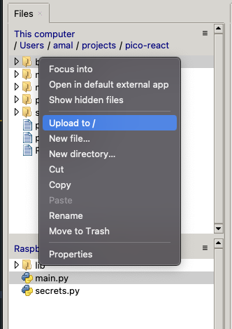
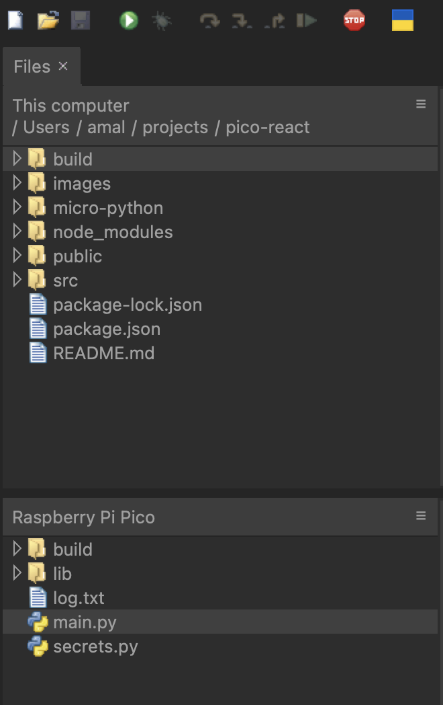
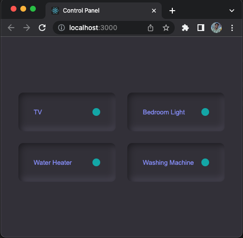

# Run React apps on Raspberry Pi Pico W

1. Clone the project
2. Build the react app by running the command `npm run build` (Make sure that you have [node.js](https://nodejs.org/en/download/) installed on your machine)
3. Connect Pico w to your machine and open it in `thonny`
4. install `phew` library to `pico w` (tools > manage packages)
5. copy `main.py` and `secrets.py` to root of pico file system.
6. open react app folder in top file browser of `thonny`, select `build` folder and click `upload to /` (make sure that you are uploading to root of pico's file system)
   
   Final folder structure:
   
7. click `run` on thonny

IP address of pico will be logged to the terminal, open this IP in browser.

    2022-10-22 08:06:44 [debug    /  137264]   - ip address:  192.168.1.12
    2022-10-22 08:06:44 [info     /  133696] > starting web server on port 80

